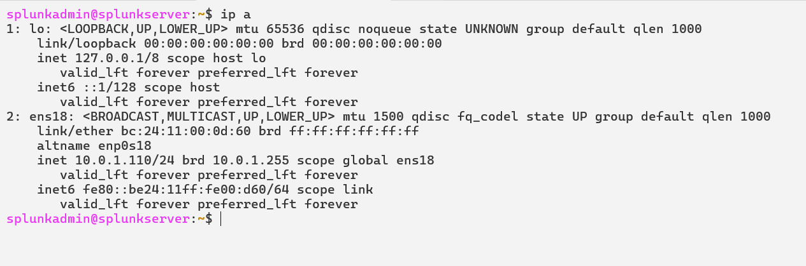
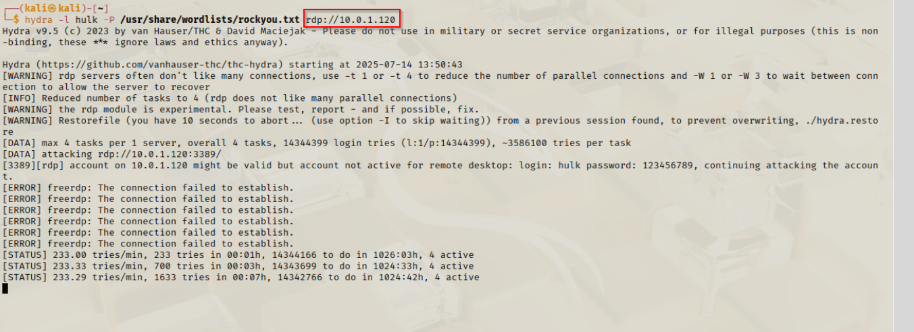
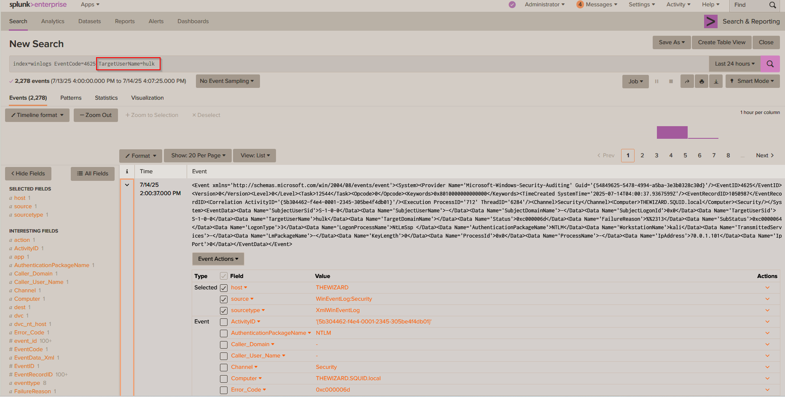
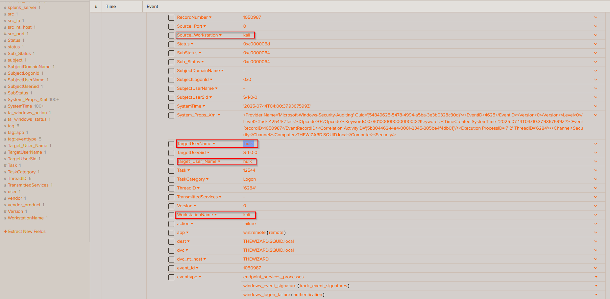
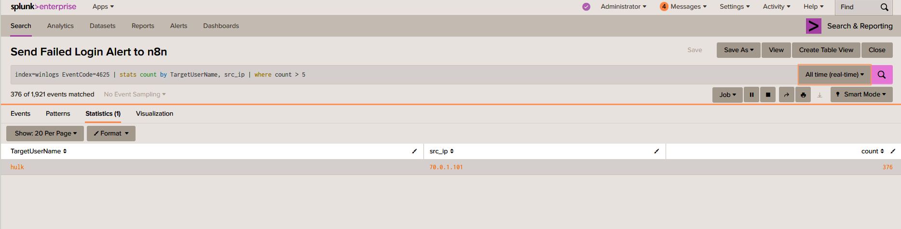
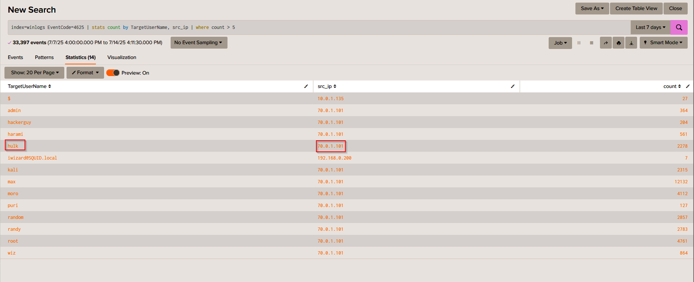
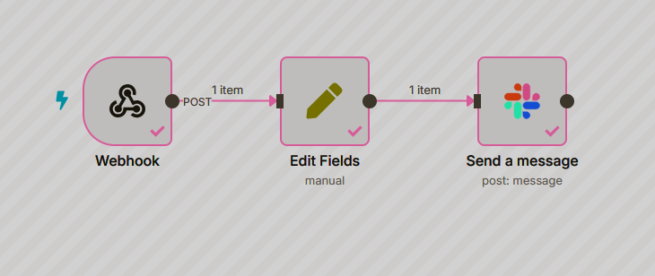
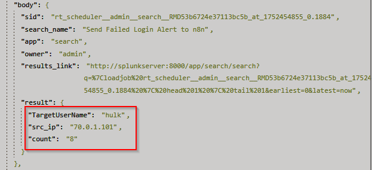
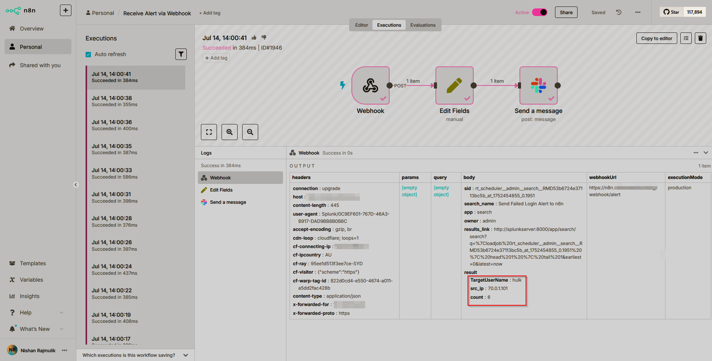
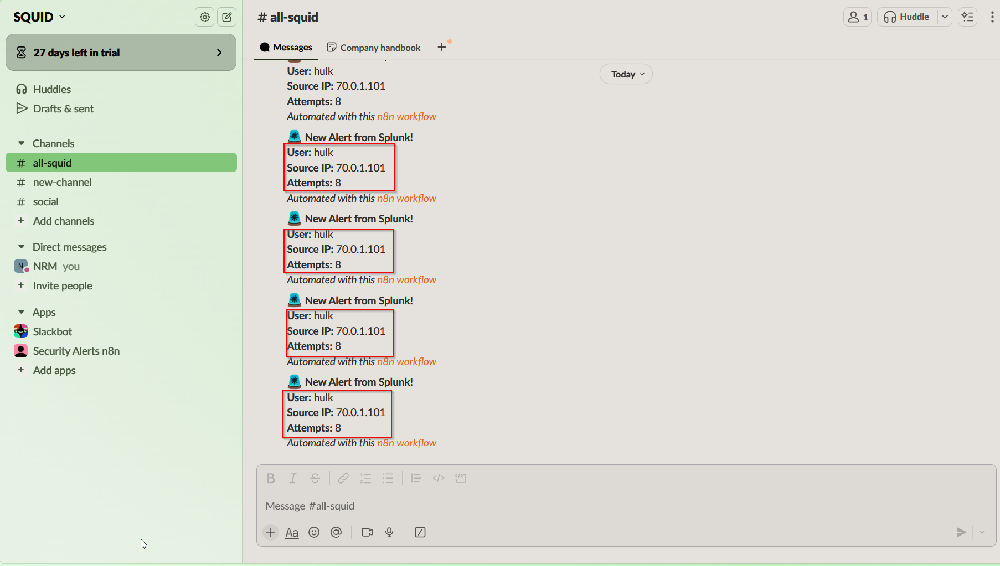

# 🔐 SIEM Lab with Splunk, pfSense, n8n & Slack Integration

This project showcases a fully functional Blue Team cybersecurity lab designed to simulate real-world Security Operations Center (SOC) workflows. It integrates **Splunk** for SIEM, **pfSense** for network segmentation, **n8n** for security automation, and **Slack** for alert delivery.

---

## 🌐 Network Architecture

---

## 🧩 Lab Components

| Component              | Role                             | IP Address     |
|------------------------|----------------------------------|----------------|
| **pfSense Firewall**   | Network segmentation             | 10.0.1.1       |
| **Splunk**             | SIEM platform                    | 10.0.1.110     |
| **Windows Server 2022**| Domain Controller (SQUID.local)  | 10.0.1.104     |
| **Windows 10**         | Domain-joined endpoint           | 10.0.1.120     |
| **Kali Linux**         | Attacker machine (isolated zone) | 70.0.1.101     |
| **n8n**                | SOAR automation engine           | 10.0.1.10      |

---

## 🖼️ Infrastructure Snapshots

### 🔹 pfSense Firewall Interface

### 🔹 Windows Server (Domain Controller)

### 🔹 Domain-Joined Windows 10 Endpoint

### 🔹 Splunk SIEM Interface

### 🔹 n8n Automation Engine

### 🔹 Kali Linux Attacker

---

## 🚨 Simulated Attack: Brute-Force Attack From Kali to Windows

---

## 🔁 Workflow Overview

### 1️⃣ Log Collection
- Windows logs are collected via **Splunk Universal Forwarder** and sent to Splunk for indexing.

### 2️⃣ Threat Detection in Splunk
- Correlation searches identify brute-force attempts and suspicious PowerShell usage.
- Examples:
  
  
  
  

### 3️⃣ Splunk → n8n Webhook Trigger
- Alerts are forwarded to n8n via webhook.
  

### 4️⃣ n8n → Slack Automation
- n8n parses JSON data and generates Slack notifications with alert context.
  
  

### 5️⃣ Analyst Notification via Slack
- Real-time visibility for analysts through Slack integration.
  

---

## 💡 Key Features

- ✅ End-to-end SIEM + SOAR pipeline using open-source and enterprise tools
- ✅ Real-time detection and alerting of brute-force attacks
- ✅ Fully segmented lab with isolated attacker subnet
- ✅ Automation of alerting workflows with n8n + Slack

---

## 🎓 Learning Outcomes

- Build and configure a home SOC lab
- Understand and apply detection engineering with Splunk
- Automate incident alerting using webhooks and n8n
- Deliver SOC alerts via Slack for analyst response

---

## 🙌 Credits

Created by [Nishan Rajmulik](https://www.linkedin.com/in/nishanrajmulik)  
🎯 Part of my hands-on cybersecurity journey to master SIEM, SOAR, and Blue Team operations.

---

## 📜 License

MIT License
