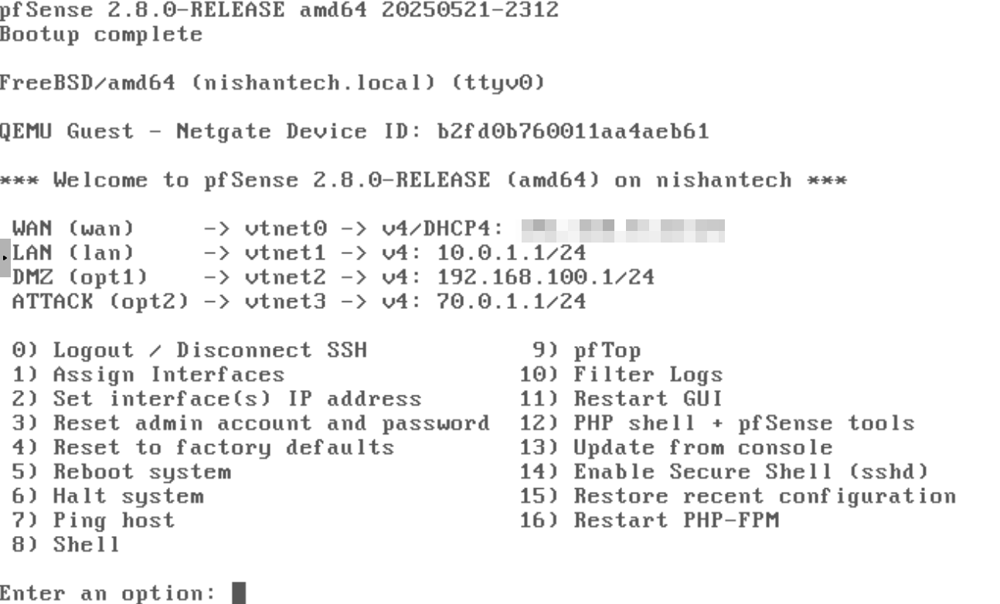
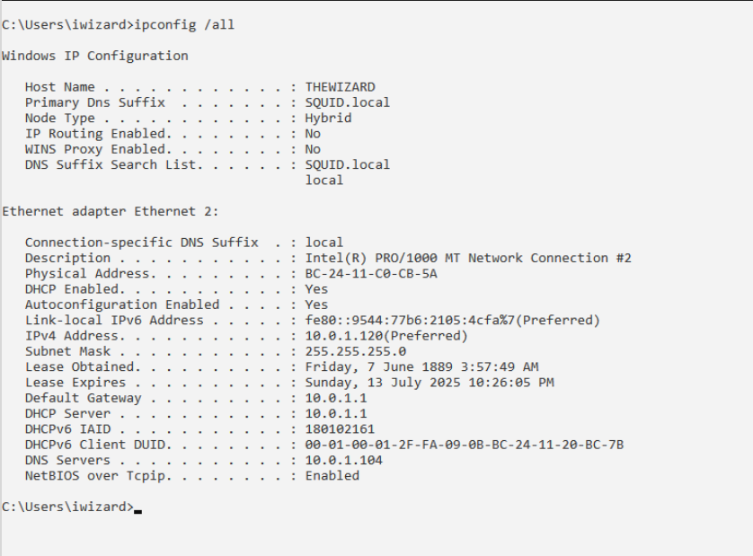
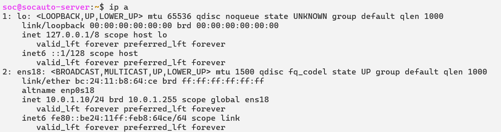
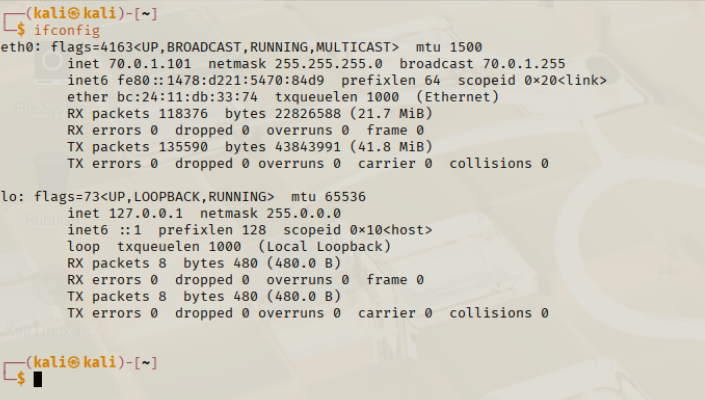

# SIEM Lab with Splunk, pfSense, n8n & Slack Integration

This project demonstrates a hands-on SIEM lab environment designed to simulate real-world SOC workflows with log collection, alert generation, and automation using n8n and Slack integration.

---

## 🔧 Lab Components

| Component            | Role                           | IP Address     |
|--------------------- |------------------------------- |----------------|
| pfSense Firewall     | Network segmentation           | 10.0.1.1       |
| Splunk               | SIEM platform                  | 10.0.1.110     |
| Windows Server 2022  | Domain Controller (SQUID.local)| 10.0.1.104     |
| Windows 10           | Domain-joined endpoint         | 10.0.1.120     |
| Kali Linux           | Attacker machine               | 70.0.1.101     |
| n8n                  | SOAR automation engine         | 10.0.1.10      |

---

## 🛠️ Features

- Log collection from Windows endpoints via Universal Forwarder
- Alert creation in Splunk for suspicious activity (e.g., PowerShell abuse, failed logons)
- Automated alert forwarding using n8n webhook
- Slack notifications with key alert details
- Network isolation between internal and attack zones via pfSense

---

## 🌐 Network Diagram

---

## 🚀 How It Works

1. **Log Collection** → Windows logs are sent to Splunk via Universal Forwarder.
2. **Alert Detection** → Splunk searches detect anomalies and trigger alerts.
3. **n8n Webhook** → Splunk alert webhook forwards to n8n.
4. **Automation** → n8n parses and sends alert to Slack channel.
5. **SOC Visibility** → Slack receives alert messages for analyst review.

---

## 📁 Configurations
**pfSense**

**Windows Server**

**Domain PC**

**Splunk SIEM**

**n8n Automation**

**Attacker IP**

---

## 📚 Learning Outcomes

- SIEM setup and log forwarding
- Alert creation and tuning
- SOAR automation using open-source tools
- Hands-on cybersecurity detection and response workflows

---
